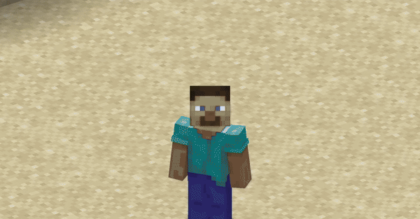
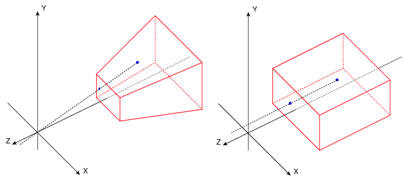

# OrthoCamera

Minecraft **NeoForge** client-side mod. Adds Toggleable & configurable orthographic view mode.

> This is an unofficial **NeoForge 26.2 port** of [OrthoCamera](https://github.com/DimasKama/OrthoCamera) by **DimasKama**.
> Original mod is for Fabric. All credits for the original design and implementation go to him.



## Download

Releases can be found on the [Releases page](https://github.com/manel740/OrthoCamera-NeoForge-Port/releases).

## What is this

In the perspective view (the default), objects which are far away are smaller than those nearby. In the orthographic view, all objects appear at the same scale.

Minecraft uses perspective view to draw the world. It gives a first-person feel.

This mod allows you to enable orthographic view and configure the frustum in detail.



## Requirements

- **Java 25**
- **NeoForge 26.2** (`26.2.0.8-beta` or newer)
- **Minecraft 26.2**

## Use

You can open the config screen from the mods list or by the hotkey. You can configure:

- Saving enabled state between client restarts
- X and Y camera scale
- Minimum and maximum view distance (position of the frustum's near and far plane)
- Fix camera (lock mouse rotation. Allows you to play the game normally, but with an orthographic view)
- Fixed camera rotation
- Fixed camera rotation speed (when rotating using hotkeys)
- Hide world border

There are also 8 hotkeys for:

- Toggle orthographic view
- Increase scale
- Decrease scale
- Fix camera
- Rotate fixed camera (up / down / left / right)

Default keys (numpad):

| Key | Action |
|-----|--------|
| `KP_4` | Toggle orthographic view |
| `KP_ADD` | Increase scale |
| `KP_SUBTRACT` | Decrease scale |
| `KP_MULTIPLY` | Fix camera |

The remaining 4 keys (open options, rotate camera up/down/left/right) have no default binding. Assign them in **Options → Controls → Key Binds**, under the **OrthoCamera** category.

Fixed camera demonstration:


## Compatibility

- Using the **Sodium** mod, you have to disable **"Use Block Face Culling"** in the **Performance** tab of Sodium's options. Otherwise, some block faces will not render with big scale.
- However, the **Nvidium** mod forces this Sodium feature to be enabled. So you have to **disable the Nvidium** mod, if you have it.
- After disabling, you probably need to press **F3 + T** to apply the change.

## Building from source

```bat
gradlew.bat build